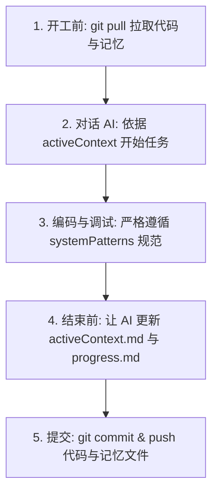

# 团队多模型 AI 协同开发指南 (Team AI Collaboration Guide)
> **适用于跨电脑、跨账号、跨模型（Gemini / GPT / Claude / DeepSeek / Cursor / Codex）的统一项目记忆规范**

---

## 📖 1. 为什么需要这份指南？

在团队共同开发一个项目时，每个成员使用的工具和 AI 可能各不相同：
- 成员 A 习惯用 **Cursor / GPT-4o**
- 成员 B 习惯用 **Google Antigravity (Gemini)**
- 成员 C 习惯用 **Claude Code / Claude Desktop**
- 成员 D 习惯在终端使用 **OpenAI Codex CLI** 或在 VS Code 使用 **GitHub Copilot**

**痛点**：AI 模型本身是无状态的。如果各自直接问各自的 AI，会导致：
1. 上下文脱节，AI 不知道其他队友昨天做了什么修改。
2. 架构规范被破坏，AI 随意引入重复库或不符合团队约定的设计模式。
3. 接手他人未完成的任务时，需要花大量时间给 AI “讲背景故事”。

**解决方案**：
采用 **Memory Bank（记忆银行）规范**，将项目记忆作为标准 Markdown 文件保存在 Git 代码仓库中。**代码与记忆同版本同步**，任何成员拉取代码后，其背后的 AI 都能立刻接力开发！

---

## 🗂️ 2. 项目记忆核心结构

在项目根目录下，维护一个 `memory-bank/` 目录和入口引导文件：

```text
your-project/
├── AGENTS.md                  # 🌟 所有 AI 客户端必须首先读取的通用指导规则
├── GEMINI.md                  # Antigravity 专属规则
├── .cursorrules               # Cursor 编辑器专属规则
├── .github/
│   └── copilot-instructions.md# VS Code GitHub Copilot 专属规则
└── memory-bank/               # 🧠 团队共享记忆核心目录
    ├── activeContext.md       # 【核心接力棒】当前最新进度、最近决策、下一步待办
    ├── projectbrief.md        # 项目核心目标、边界、核心业务价值
    ├── productContext.md      # 业务场景、用户需求、设计初衷
    ├── systemPatterns.md      # 架构模式、代码分层规范、团队约定
    ├── techContext.md         # 依赖库、版本要求、环境约束与避坑指南
    └── progress.md            # 功能完成度清单、待办列表、已知问题
```

### 记忆文件职责分工速查表

| 文件名 | 职责与内容 | 更新频次 |
| :--- | :--- | :--- |
| **`activeContext.md`** | **工作接力棒**：记录今天改了什么、当前项目停在哪个状态、留给下一个队友/AI 的具体下一步清单。 | **每次任务必更** |
| **`systemPatterns.md`** | **架构宪法**：约定的分层、命名规范、设计模式，防止 AI 胡乱写代码。 | 有新架构调整时更新 |
| **`techContext.md`** | **技术底座**：Node/Python/Go 版本、核心依赖版本、第三方 Key 配置说明等。 | 依赖变更时更新 |
| **`progress.md`** | **里程碑看板**：功能模块完成百分比、已实现特性、当前 Bug 清单。 | 阶段性功能完成时更新 |
| **`projectbrief.md`** | **初心与边界**：项目做什么、不做什么。 | 初期确定，很少改动 |

---

## 🛠️ 3. 各模型与工具接入方法

团队成员在不同工具中只需做极简的配置，就能让 AI 自动加载记忆：

### 1) Antigravity (Gemini) 用户
- **机制**：项目根目录已包含 `GEMINI.md` 和 `AGENTS.md`。
- **操作**：打开项目后，Gemini 会自动加载全局/项目技能。
- **指令**：直接对话即可，如：“*查看当前状态并继续开发*”。

### 2) OpenAI Codex / 命令行 Agent 用户
- **机制**：OpenAI 官方及现代 Agent 工具默认自动读取根目录的 `AGENTS.md`。
- **操作**：直接在项目根目录下启动 Codex CLI 或 Agent。
- **指令**：Codex 启动时会自动读取 `AGENTS.md` 并首先加载 `memory-bank/activeContext.md`。

### 3) Cursor / Windsurf 用户
- **机制**：根目录下已配置 `.cursorrules` 与 `AGENTS.md`。
- **操作**：在 Composer / Chat 模式下，直接输入提示，或在提问时附带 `@memory-bank/activeContext.md` 引用。

### 4) VS Code GitHub Copilot 用户
- **机制**：根目录已配置 `.github/copilot-instructions.md`。
- **操作**：在 Copilot Chat 中，AI 会根据指导首先查阅 `memory-bank/` 文件。

### 5) 网页端 AI（ChatGPT / Claude.ai / Gemini Web）
若团队有人习惯在网页端粘贴代码协作，可以在新对话的第 1 轮直接发送如下引导词：

```text
我正在参与一个团队项目。该项目使用 memory-bank 维护记忆。
请先阅读以下 memory-bank/activeContext.md 和 memory-bank/systemPatterns.md 的内容：
[此处粘贴 activeContext.md 与 systemPatterns.md]
请基于上述上下文，帮我完成接下来的任务。在任务结束时，请按照格式为我输出更新后的 activeContext.md 供我回填。
```

---

## 🔄 4. 团队日常协作标准流程 (SOP)

为保证记忆永不掉线，所有团队成员请遵守 **4 步工作流**：



### 步骤 1：开工前（拉取最新记忆）
```bash
git pull origin main
```
拉取代码的同时，你也拉取了上一个队友让 AI 写好的 `activeContext.md`。

### 步骤 2：唤醒你的 AI 助手
无论使用哪个模型，首句提示词输入：
> 💬 **开工提示词**：
> “*请读取 `memory-bank/activeContext.md` 和 `memory-bank/systemPatterns.md`，了解前人留下的最新进展与下一步任务，然后准备开始工作。*”

AI 读取完毕后，会向你复述它接收到的现状和接下来的计划。

### 步骤 3：编写业务代码
在开发过程中，AI 会严格遵守 `systemPatterns.md` 中约束的技术风格。

### 步骤 4：收尾交接（更新记忆）
在准备下班、切换分支或提交代码前，**务必让 AI 更新记忆**：
> 💬 **收工提示词**：
> “*本次功能已完成。请按照规范更新 `memory-bank/activeContext.md`（记录本次改动与留给下一个人的下一步事项），并同步更新 `memory-bank/progress.md`。*”

### 步骤 5：提交 Git
将你的代码变更与 `memory-bank/` 的变更一同提交并推送到远端：
```bash
git add .
git commit -m "feat(auth): 完成用户登录模块并同步更新 activeContext 记忆"
git push origin feature-branch
```

---

## 💬 5. 常用提示词模板库 (复制即用)

建议将以下提示词收藏，日常协作时直接使用：

#### 模板 A：日常开工接力
```text
请首先阅读 memory-bank/activeContext.md。
告诉我当前项目的最新状态，以及上一个开发/模型留下的下一步待办是什么。确认后我们开始。
```

#### 模板 B：任务完成，交接给队友
```text
我们已经完成了当前阶段的开发并测试通过。
请帮我更新 memory-bank/activeContext.md：
1. 总结本次新增或修改了哪些核心文件和逻辑；
2. 详细列出接下来需要完成的 2~3 个具体待办（供其他队友或下一个 AI 接力）；
3. 如果有待办完成，请同步勾选 memory-bank/progress.md 中的复选框。
```

#### 模板 C：新增架构规范 / 引入新技术
```text
我们在项目中引入了 [例如：Zod 做接口参数校验 / Redis 缓存中间件]。
请在 memory-bank/systemPatterns.md 和 techContext.md 中追加这一约定，
写明以后的模块必须遵循的使用范式和注意事项。
```

---

## ⚠️ 6. 常见问题与避坑建议 (FAQ)

1. **Q: 两人同时修改代码，Git 发生 `memory-bank` 冲突怎么办？**
   - **A**：`activeContext.md` 通常每个分支各自记录该分支的工作。合并主干（PR）时，只需保留最新的整体进度，并在主干上将两者的“下一步事项”合并为一个清单即可。
2. **Q: 会不会导致文件越来越长、Token 消耗过大？**
   - **A**：**不要在 memory-bank 中贴入大段代码！** 记忆文件只记录“决策、文件名索引、状态、待办”。`activeContext.md` 应保持在 50~100 行以内，旧的琐碎历史可以定期归档或清理。
3. **Q: 队友忘记让 AI 更新记忆怎么办？**
   - **A**：代码审查（Code Review / PR）时，建议把“*是否更新了 memory-bank/activeContext.md*”作为 Review Checklist 的一项。只需花 10 秒钟让 AI 自动生成并 commit 即可。
